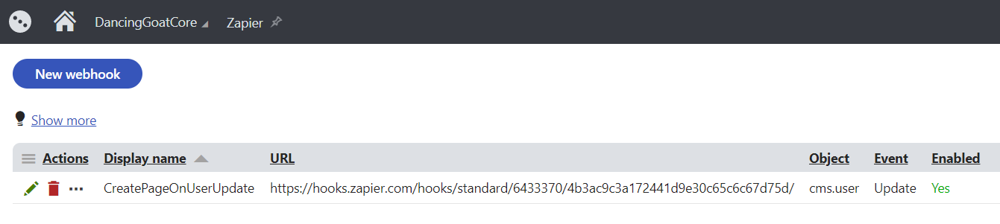
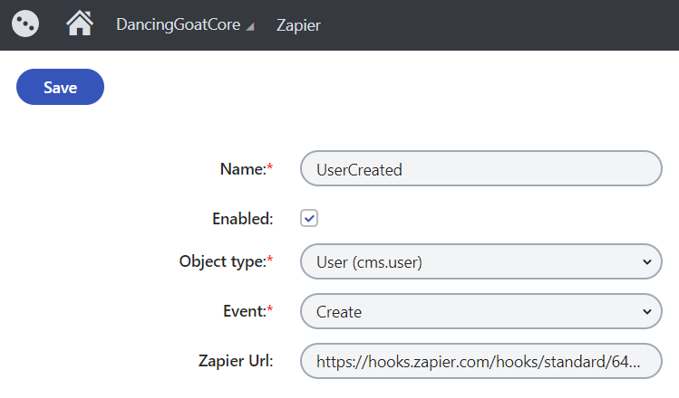

# Zapier custom module

A custom module for the [Xperience Zapier integration](https://github.com/kentico-ericd/xperience-zapier-cli) to be installed on the Xperience CMS project. This module enables adminstrators to create triggers in Xperience that will fire Zaps when global events occur. Webhooks are automatically registered in the Xperience UI when using the native Zapier integration.

There is also a custom workflow action and custom marketing automation action for triggering Zaps.

## Installing

1. Install the [Xperience.Zapier.Common](https://www.nuget.org/packages/Xperience.Zapier.Common) and [Xperience.Zapier](https://www.nuget.org/packages/Xperience.Zapier) NuGet packages in the CMS project
1. Build the CMS project
1. If you would like to trigger Zaps using a [marketing automation](https://docs.xperience.io/on-line-marketing-features/configuring-and-customizing-your-on-line-marketing-features/configuring-marketing-automation/developing-custom-marketing-automation-actions) step or [workflow step](https://docs.xperience.io/configuring-xperience/configuring-the-environment-for-content-editors/configuring-workflows/designing-advanced-workflows/creating-custom-action-workflow-steps), import the _/App_Data/CMSModules/Xperience.Zapier/Xperience.Zapier.zip_ package from the __Sites application__: [Importing a site or objects](https://docs.xperience.io/deploying-websites/exporting-and-importing-sites/importing-a-site-or-objects)
1. If you want to trigger Zaps when custom code runs on the front-end .NET Core or MVC application (as opposed to only operations in the Xperience UI), install the [Xperience.Zapier.Common](https://www.nuget.org/packages/Xperience.Zapier.Common) NuGet package in the front-end application

## Using the module

After installing the NuGet packages in the Xperience application, you can find a new __Zapier__ module under the __Configuration__ menu. This will list the created webhooks and allow you to fine-tune or disable them if necessary. You _do not_ need to create webhooks in Xperience unless you are setting them up manually- Zapier will create them automatically!

Webhooks are created automatically when using the __Catch Xperience Webhook__ in Zapier, as described [here](https://github.com/kentico-ericd/xperience-zapier-cli#creating-a-webhook). You can also create webhooks directly in the Xperience UI to trigger any generic Zap when events occur in Xperience:

1. Create a new Zap on http://zapier.com using the __Webhooks by Zapier__ app and the __Catch hook__ action
1. Copy the __Custom Webhook URL__ in the trigger
1. In the Xperience __Zapier__ module, create a new webhook
1. Choose an object type from the drop-down list and an event. When the selected event occurs for objects of that type, the Zap will be triggered
1. Paste the Zapier URL in the __Zapier Url__ field

## Compatibility

The code and import files provided by package this were built against the Xperience 13.0.0 libraries, but should work for any higher hotfix version as well.

## Feedback & Contributing

Check out the [contributing](https://github.com/kentico-ericd/xperience-zapier/blob/master/CONTRIBUTING.md) page to see the best places to file issues, start discussions, and begin contributing.

## License

The repository is available as open source under the terms of the [MIT License](https://opensource.org/licenses/MIT).
